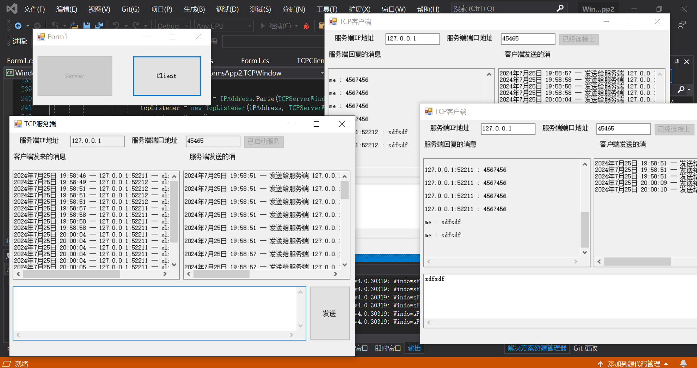
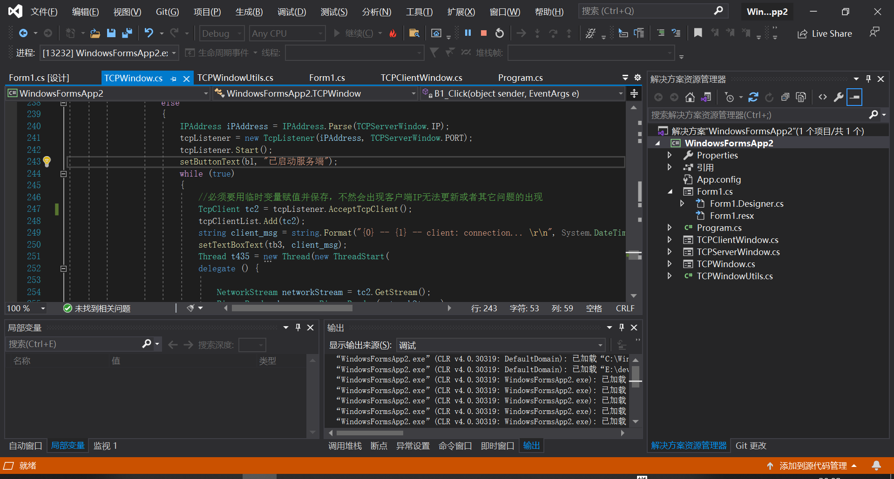
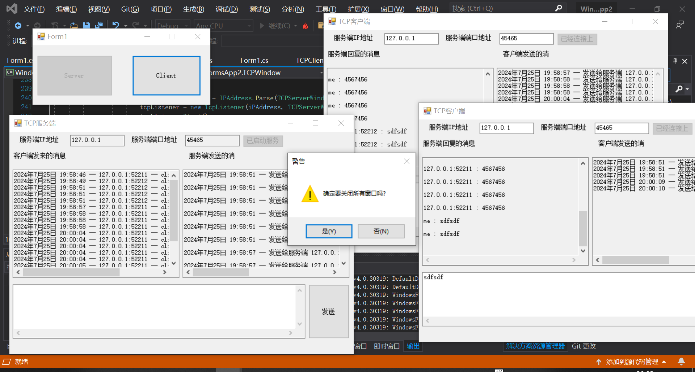

- 基于C#编写的TCP聊天室（一对多）

测试环境：

	Visual Studio 2019
		
	System : Windows 10 18363 专业版
	
	内存大小 16G  双8G
	
	存储硬盘 某杂牌机械 5400转
	
	
	
	

该软件的界面、功能是由C#、Winform实现.

C#部分主要用到了TcpClient、NetworkStream、多线程、委托、事件、面向对象技术.

Winform部分主要用到了按钮、消息弹窗、文本编辑框组件.

该软件主要是用来进行TCP通信的，支持一个服务端同时对接多个客户端，并且支持多个客户端信息同步.

更新日期:2024年7月25日

软件界面一览：

  
